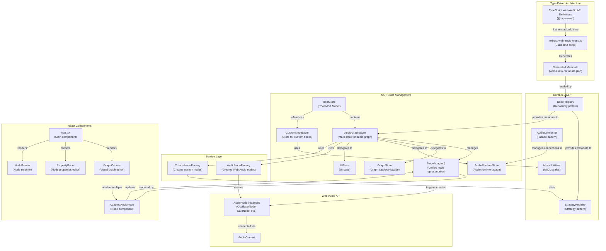
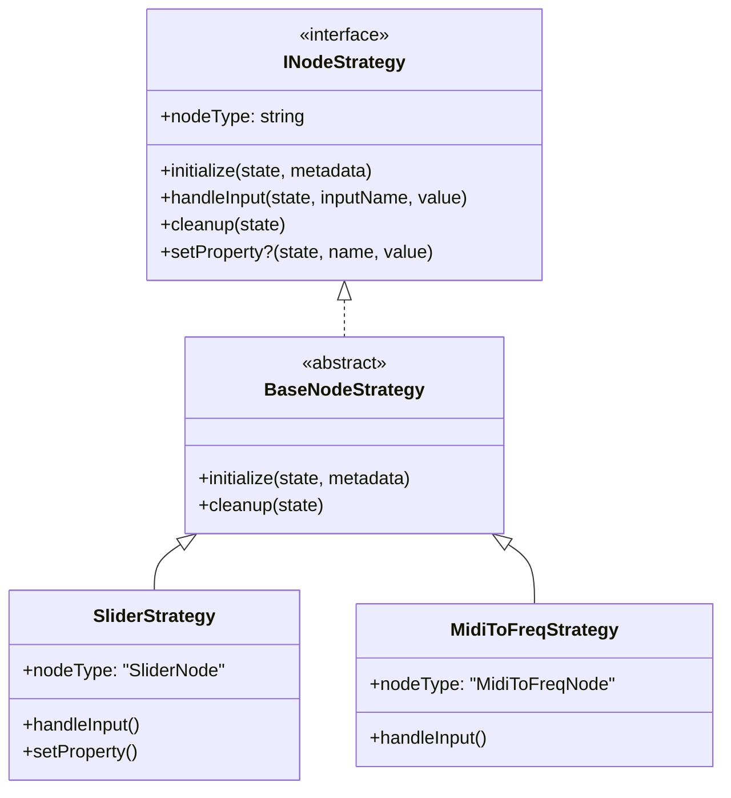
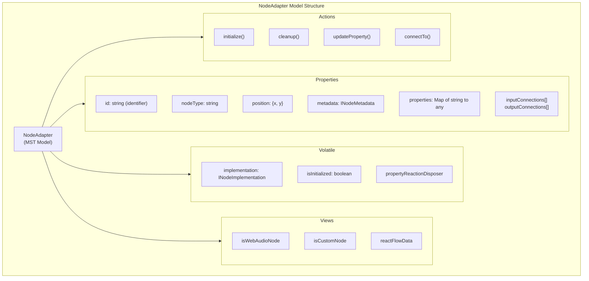
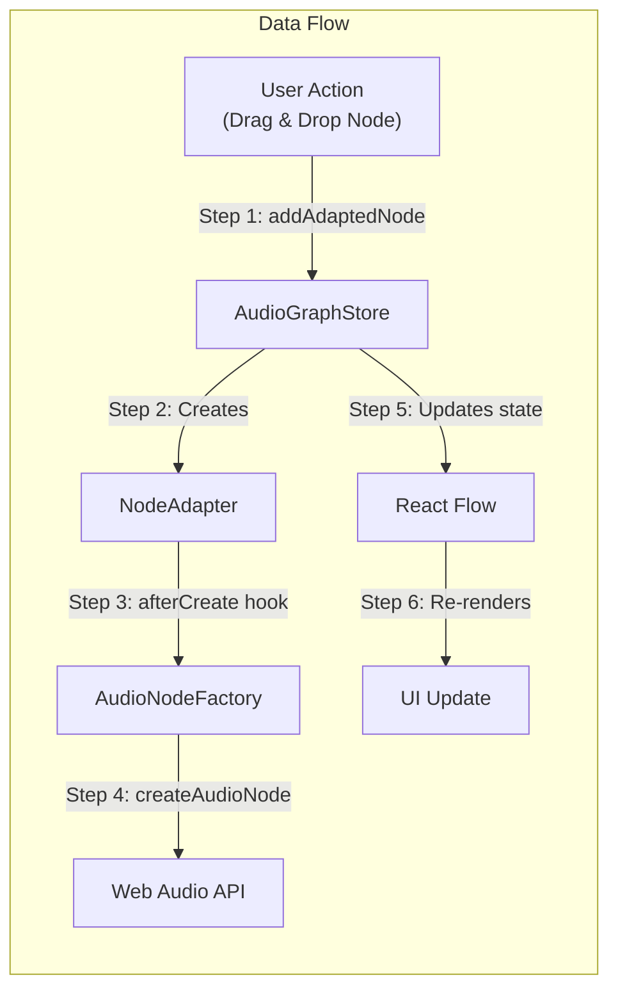
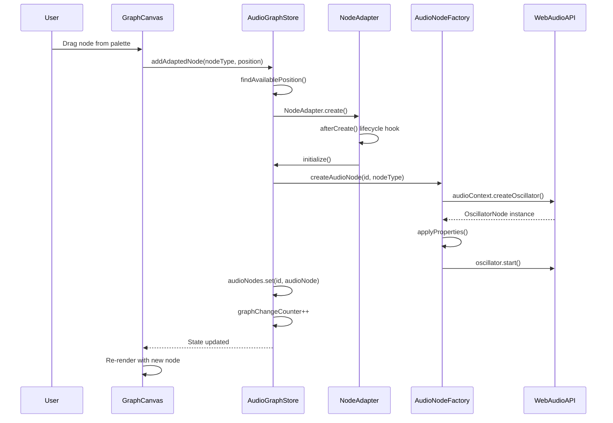
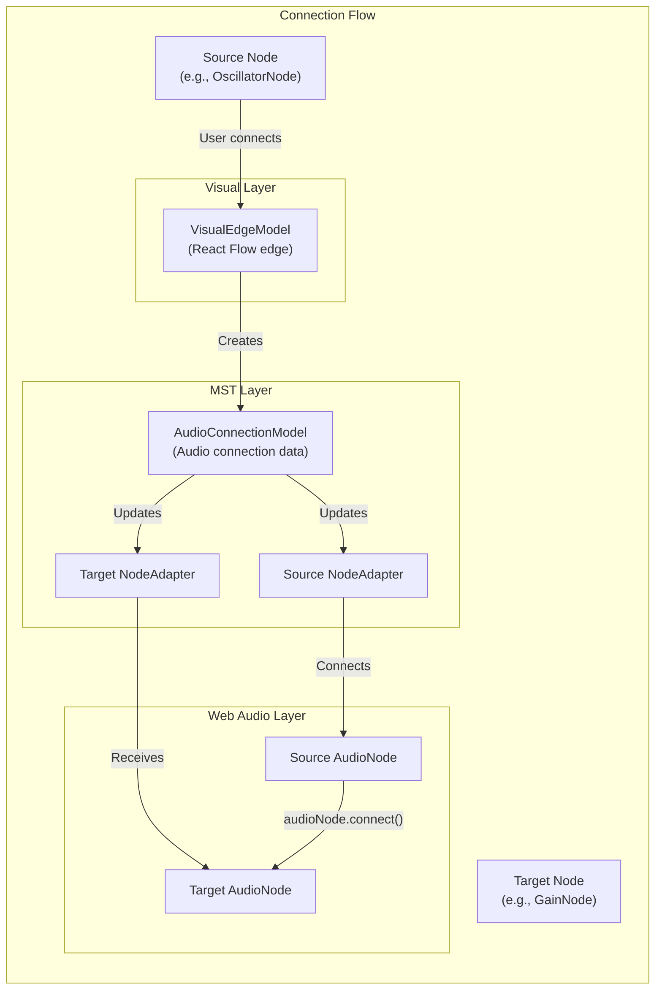

# Visual Web Audio Architecture

## Table of Contents

- [Overview](#overview)
- [Type-Driven Development Core](#type-driven-development-core)
- [Domain Layer](#domain-layer)
- [MobX State Tree (MST) Architecture](#mobx-state-tree-mst-architecture)
- [Service Layer](#service-layer)
- [React Component Architecture](#react-component-architecture)
- [Data Flow](#data-flow)
- [Key Design Patterns](#key-design-patterns)
- [Memory Management](#memory-management)
- [Progressive Web App Features](#progressive-web-app-features)

## Overview

Visual Web Audio is built on a type-driven architecture that automatically extracts Web Audio API metadata from TypeScript definitions, creating a maintainable and extensible visual audio programming environment.

### High-Level Architecture



## Type-Driven Development Core

The most innovative aspect of this application is its type-driven approach:

- **Build-time Type Extraction**: The `extract-web-audio-types.js` script runs during build to extract metadata directly from TypeScript's Web Audio API definitions (`@types/web`)
- **Dynamic Discovery**: The script automatically discovers all Web Audio interfaces by analyzing TypeScript definitions, ensuring new nodes are automatically supported when TypeScript updates
- **Zero Maintenance**: No hardcoded node definitions need to be maintained - the app evolves with the Web Audio API specification

### Type Extraction Process

1. The script analyzes TypeScript's DOM type definitions
2. Discovers Web Audio interfaces dynamically
3. Extracts properties, methods, and events for each node type
4. Generates comprehensive metadata including:
   - Property types and ranges
   - Default values
   - Input/output configurations
   - Node categories

## Domain Layer

The domain layer contains pure business logic with no React or MobX dependencies. This layer follows clean architecture principles and implements several design patterns.

### Directory Structure

```
src/domain/
  music/                     # Music theory utilities
    midiUtils.ts             # MIDI note <-> frequency conversion
    scaleUtils.ts            # Scale/key/mode calculations
    index.ts                 # Public API exports
  nodes/                     # Node management
    strategies/              # Strategy pattern implementations
      INodeStrategy.ts       # Strategy interface
      StrategyRegistry.ts    # Strategy registry
      ButtonStrategy.ts      # Button node behavior
      SliderStrategy.ts      # Slider node behavior
      MidiToFreqStrategy.ts  # MIDI to frequency conversion
      ScaleToMidiStrategy.ts # Scale to MIDI conversion
      DisplayStrategy.ts     # Display node behavior
      ...                    # Other strategies
    NodeRegistry.ts          # Repository pattern for metadata
    index.ts                 # Public API exports
  audio/                     # Audio connection management
    AudioConnector.ts        # Facade for audio connections
```

### Music Utilities (`domain/music/`)

Centralized music theory calculations, eliminating code duplication across stores:

```typescript
// MIDI utilities
midiToFrequency(midiNote: number): number    // MIDI note -> Hz
frequencyToMidi(frequency: number): number   // Hz -> MIDI note
midiToNoteName(midiNote: number): string     // MIDI note -> "C4", "A#3", etc.

// Scale utilities
scaleToMidi(degree: number, key: Key, mode: Mode): number
scaleToFrequency(degree: number, key: Key, mode: Mode): number
getScaleIntervals(mode: Mode): number[]
```

### Strategy Pattern (`domain/nodes/strategies/`)

Each custom node type has its own strategy that encapsulates its behavior:



The `StrategyRegistry` provides centralized access to all strategies:

```typescript
strategyRegistry.getStrategy('SliderNode')    // Get specific strategy
strategyRegistry.hasStrategy('SliderNode')    // Check if custom node
strategyRegistry.getAllStrategyTypes()        // Get all custom node types
```

### Repository Pattern (`domain/nodes/NodeRegistry.ts`)

The `NodeRegistry` provides unified access to all node metadata:

```typescript
nodeRegistry.getMetadata('OscillatorNode')   // Get specific metadata
nodeRegistry.getAllMetadata()                 // Get all metadata
nodeRegistry.isCustomNode('SliderNode')       // Check node type
nodeRegistry.getCustomNodeTypes()             // Get custom node types
nodeRegistry.getWebAudioNodeTypes()           // Get Web Audio node types
nodeRegistry.getCategories()                  // Get all categories
```

### Facade Pattern (`domain/audio/AudioConnector.ts`)

Simplifies complex audio connection logic:

```typescript
class AudioConnector {
  connect(sourceId, targetId, sourceHandle?, targetHandle?): boolean
  disconnect(sourceId, targetId, sourceHandle?, targetHandle?): void
  isValidConnection(sourceId, targetId, sourceHandle?, targetHandle?): boolean
}
```

## MobX State Tree (MST) Architecture

The application uses a hierarchical MST structure for state management:

### RootStore

- Top-level store that manages the entire application state
- Handles version migration for backward compatibility
- Contains references to AudioGraphStore and CustomNodeStore
- Property change counter for forcing UI re-renders

### AudioGraphStore

Central store managing the audio graph with key responsibilities:

- Node lifecycle management (creation, deletion, updates)
- Connection management (visual edges and audio connections)
- Undo/redo functionality via MST patches
- Project modification tracking
- Clipboard operations for copy/paste
- Audio context lifecycle
- Delegates specialized operations to facade stores

### Store Facades

The architecture uses facade stores to separate concerns:

#### GraphStore (Graph Topology)
- Manages graph structure (nodes, edges)
- Position calculations and auto-positioning
- Node/edge CRUD operations

#### AudioRuntimeStore (Audio Runtime)
- Manages live AudioContext
- AudioNode creation and lifecycle
- Audio connection routing
- Custom node bridges (control connections)

#### UIStore (UI State)
- Clipboard state for copy/paste
- Selected node tracking
- UI-specific transient state

### NodeAdapter Model Structure



The NodeAdapter provides:
- Unified abstraction for both Web Audio and custom nodes
- Automatic differentiation between Web Audio and custom nodes
- Property synchronization via MobX reactions
- Lifecycle hooks (afterCreate, beforeDestroy)
- Connection state management

## Service Layer

### AudioNodeFactory

- Creates and configures Web Audio API nodes
- Handles property validation and type conversion
- Manages source node lifecycle (start/stop)
- Provides fallback values for invalid inputs

### CustomNodeFactory

- Creates custom nodes (sliders, buttons, MIDI input, etc.)
- Manages bridges between custom nodes and Web Audio nodes
- Handles custom node-specific logic

## React Component Architecture

### Component Hierarchy

- **App.tsx**: Main component orchestrating the application
- **GraphCanvas**: Visual editor using React Flow
- **AdaptedAudioNode**: Individual node components
- **PropertyPanel**: Dynamic property editor
- **NodePalette**: Node selection interface

### GraphCanvas Features

- Drag-and-drop node creation
- Visual connection management
- Multi-node selection
- Keyboard shortcuts (Ctrl+C/V/X, Delete)
- Auto-positioning to prevent overlaps
- Auto-fit view when loading projects/examples

## Data Flow

### Overall Data Flow



### Node Creation Sequence



### Connection Flow



### Property Update Flow

1. User changes property in PropertyPanel
2. PropertyPanel calls `store.updateNodeProperty()`
3. NodeAdapter updates its property map
4. MobX reaction triggers `implementation.updateProperty()`
5. AudioNodeFactory applies change to Web Audio node
6. Audio output updates in real-time

## Key Design Patterns

### Strategy Pattern
Custom node behaviors are encapsulated in strategy classes (`domain/nodes/strategies/`):
- Each custom node type (Slider, Button, MidiToFreq, etc.) has its own strategy
- Strategies implement the `INodeStrategy` interface
- `StrategyRegistry` provides centralized access to all strategies
- New custom nodes are added by creating a new strategy class

### Repository Pattern
`NodeRegistry` provides centralized metadata access:
- Combines Web Audio and custom node metadata
- Single source of truth for node information
- Query methods for filtering by type, category, etc.

### Facade Pattern
Multiple facades simplify complex subsystems:
- `GraphStore`: Simplifies graph topology operations
- `AudioRuntimeStore`: Abstracts audio runtime management
- `UIStore`: Encapsulates UI state
- `AudioConnector`: Simplifies audio connection logic

### Factory Pattern
- `AudioNodeFactory`: Creates and configures Web Audio API nodes
- `CustomNodeFactory`: Creates custom nodes, delegates to strategies

### Adapter Pattern
`NodeAdapter` provides unified interface for different node types:
- Abstracts differences between Web Audio and custom nodes
- Unified property access and connection management

### Observer Pattern
MobX reactions synchronize state changes:
- Property changes trigger audio updates
- Graph changes trigger UI re-renders
- `propertyChangeCounter` forces updates for control connections

### Command Pattern
Undo/redo via MST patches:
- All state changes captured as patches
- History navigation with undo/redo actions

### Lifecycle Pattern
MST lifecycle hooks manage resource creation/cleanup:
- `afterCreate`: Initialize audio nodes
- `beforeDestroy`: Cleanup resources, dispose reactions

## Memory Management

The application implements comprehensive memory management:

- **Automatic cleanup** via MST lifecycle hooks (beforeDestroy)
- **Media stream disposal** for microphone nodes
- **Proper disconnection** of audio nodes before removal
- **Reaction disposers** to prevent memory leaks
- **Audio context lifecycle** management with proper suspension/closure
- **Clipboard cleanup** for cut operations

## Progressive Web App Features

### Offline Capabilities

- Service worker for offline functionality
- IndexedDB for local project storage
- Cached resources for instant startup
- Offline-first architecture

### Update System

- Automatic update detection via build timestamps
- Non-intrusive update notifications
- One-click updates with automatic refresh
- Background monitoring for new versions

### Installation

- Installable as native app on desktop and mobile
- Custom app icon and splash screen
- Standalone window mode
- Full offline functionality post-installation

## Code Generation

The application can export visual graphs as executable JavaScript code:

1. Traverses the audio graph starting from destination nodes
2. Generates clean, dependency-free JavaScript
3. Includes all node creation and connections
4. Preserves property values and audio routing
5. Creates fully functional Web Audio API code

This architecture achieves excellent separation of concerns, type safety, and maintainability while providing a powerful visual interface for Web Audio API programming. 