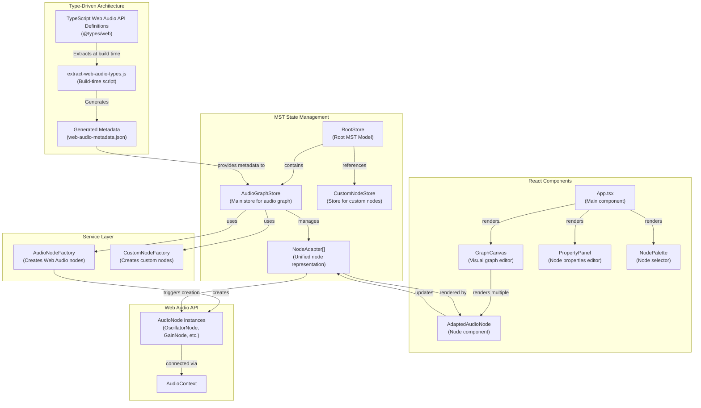
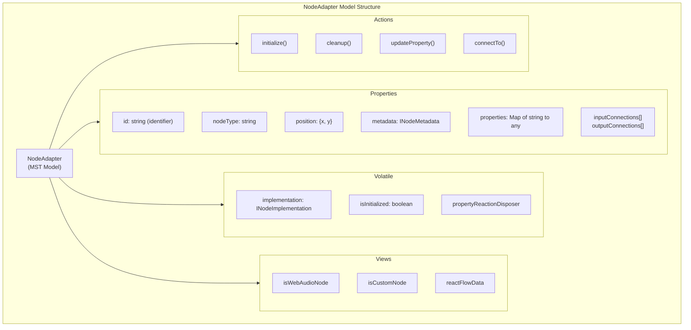
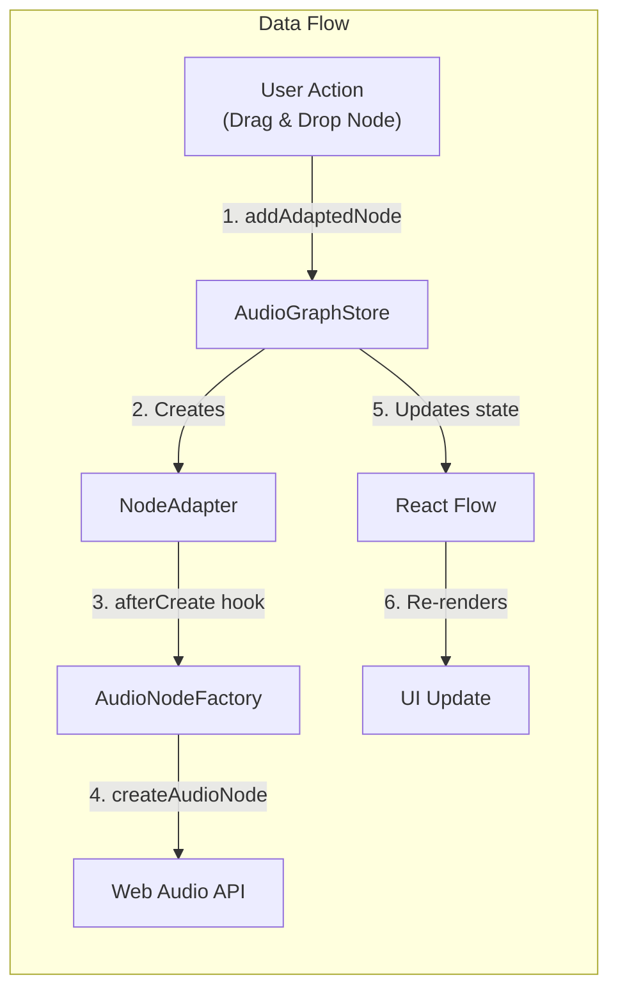
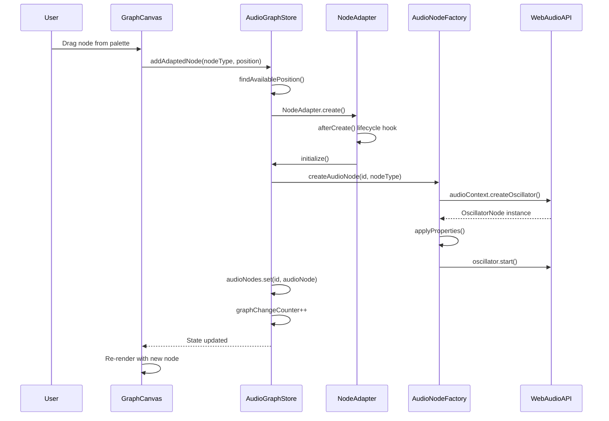
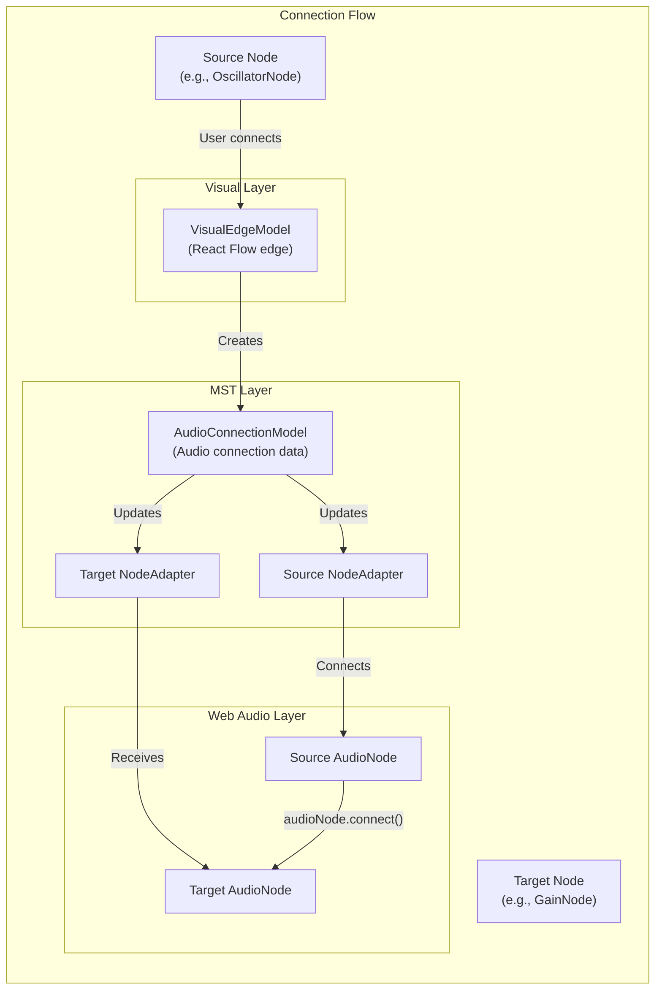

# Visual Web Audio Architecture

## Table of Contents

- [Overview](#overview)
- [Type-Driven Development Core](#type-driven-development-core)
- [MobX State Tree (MST) Architecture](#mobx-state-tree-mst-architecture)
- [Service Layer](#service-layer)
- [React Component Architecture](#react-component-architecture)
- [Data Flow](#data-flow)
- [Key Design Patterns](#key-design-patterns)
- [Memory Management](#memory-management)
- [Progressive Web App Features](#progressive-web-app-features)

## Overview

Visual Web Audio is built on a type-driven architecture that automatically extracts Web Audio API metadata from TypeScript definitions, creating a maintainable and extensible visual audio programming environment.

### High-Level Architecture

## Type-Driven Development Core

The most innovative aspect of this application is its type-driven approach:

- **Build-time Type Extraction**: The `extract-web-audio-types.js` script runs during build to extract metadata directly from TypeScript's Web Audio API definitions (`@types/web`)
- **Dynamic Discovery**: The script automatically discovers all Web Audio interfaces by analyzing TypeScript definitions, ensuring new nodes are automatically supported when TypeScript updates
- **Zero Maintenance**: No hardcoded node definitions need to be maintained - the app evolves with the Web Audio API specification

### Type Extraction Process

1. The script analyzes TypeScript's DOM type definitions
2. Discovers Web Audio interfaces dynamically
3. Extracts properties, methods, and events for each node type
4. Generates comprehensive metadata including:
   - Property types and ranges
   - Default values
   - Input/output configurations
   - Node categories

## MobX State Tree (MST) Architecture

The application uses a hierarchical MST structure for state management:

### RootStore

- Top-level store that manages the entire application state
- Handles version migration for backward compatibility
- Contains references to AudioGraphStore and CustomNodeStore

### AudioGraphStore

Central store managing the audio graph with key responsibilities:

- Node lifecycle management (creation, deletion, updates)
- Connection management (visual edges and audio connections)
- Undo/redo functionality via MST patches
- Project modification tracking
- Clipboard operations for copy/paste
- Audio context lifecycle

### NodeAdapter Model Structure

The NodeAdapter provides:
- Unified abstraction for both Web Audio and custom nodes
- Automatic differentiation between Web Audio and custom nodes
- Property synchronization via MobX reactions
- Lifecycle hooks (afterCreate, beforeDestroy)
- Connection state management

## Service Layer

### AudioNodeFactory

- Creates and configures Web Audio API nodes
- Handles property validation and type conversion
- Manages source node lifecycle (start/stop)
- Provides fallback values for invalid inputs

### CustomNodeFactory

- Creates custom nodes (sliders, buttons, MIDI input, etc.)
- Manages bridges between custom nodes and Web Audio nodes
- Handles custom node-specific logic

## React Component Architecture

### Component Hierarchy

- **App.tsx**: Main component orchestrating the application
- **GraphCanvas**: Visual editor using React Flow
- **AdaptedAudioNode**: Individual node components
- **PropertyPanel**: Dynamic property editor
- **NodePalette**: Node selection interface

### GraphCanvas Features

- Drag-and-drop node creation
- Visual connection management
- Multi-node selection
- Keyboard shortcuts (Ctrl+C/V/X, Delete)
- Auto-positioning to prevent overlaps
- Auto-fit view when loading projects/examples

## Data Flow

### Overall Data Flow

### Node Creation Sequence

### Connection Flow

### Property Update Flow

1. User changes property in PropertyPanel
2. PropertyPanel calls `store.updateNodeProperty()`
3. NodeAdapter updates its property map
4. MobX reaction triggers `implementation.updateProperty()`
5. AudioNodeFactory applies change to Web Audio node
6. Audio output updates in real-time

## Key Design Patterns

1. **Adapter Pattern**: NodeAdapter provides unified interface for different node types
2. **Factory Pattern**: AudioNodeFactory and CustomNodeFactory handle node creation
3. **Observer Pattern**: MobX reactions synchronize state changes
4. **Command Pattern**: Undo/redo via MST patches
5. **Strategy Pattern**: Different node types implement INodeImplementation interface
6. **Lifecycle Pattern**: MST lifecycle hooks manage resource creation/cleanup

## Memory Management

The application implements comprehensive memory management:

- **Automatic cleanup** via MST lifecycle hooks (beforeDestroy)
- **Media stream disposal** for microphone nodes
- **Proper disconnection** of audio nodes before removal
- **Reaction disposers** to prevent memory leaks
- **Audio context lifecycle** management with proper suspension/closure
- **Clipboard cleanup** for cut operations

## Progressive Web App Features

### Offline Capabilities

- Service worker for offline functionality
- IndexedDB for local project storage
- Cached resources for instant startup
- Offline-first architecture

### Update System

- Automatic update detection via build timestamps
- Non-intrusive update notifications
- One-click updates with automatic refresh
- Background monitoring for new versions

### Installation

- Installable as native app on desktop and mobile
- Custom app icon and splash screen
- Standalone window mode
- Full offline functionality post-installation

## Code Generation

The application can export visual graphs as executable JavaScript code:

1. Traverses the audio graph starting from destination nodes
2. Generates clean, dependency-free JavaScript
3. Includes all node creation and connections
4. Preserves property values and audio routing
5. Creates fully functional Web Audio API code

This architecture achieves excellent separation of concerns, type safety, and maintainability while providing a powerful visual interface for Web Audio API programming. 