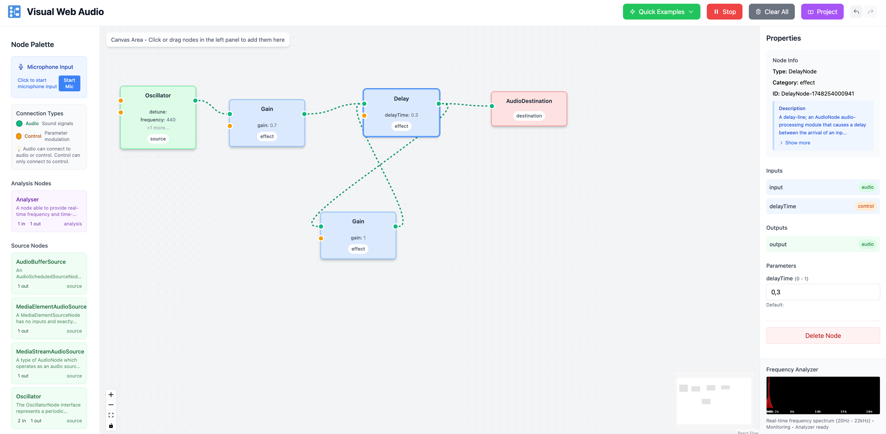

# Visual Web Audio (alpha)

[](https://github.com/miltonlaufer/visualwebaudio/actions/workflows/pr-checks.yml)
[](https://www.typescriptlang.org/)
[](https://reactjs.org/)
[](https://vitejs.dev/)
[](https://github.com/miltonlaufer/visualwebaudio)
[](LICENSE)



🌐 **[Live Demo](https://www.miltonlaufer.com.ar/visualwebaudio/)** - Try the application online!

A type-driven React TypeScript application for visual Web Audio API editing. This project demonstrates type-driven development by extracting all node information directly from the standard TypeScript definitions for the Web Audio API, ensuring the application stays current with API changes automatically.

## Core Innovation: Type-Driven Development

Unlike traditional audio editors that hardcode node definitions, this project:

- Extracts metadata directly from TypeScript's Web Audio API definitions (`@types/web`)
- Automatically discovers new nodes and properties when TypeScript definitions are updated
- Ensures type safety throughout the entire application
- Stays current with Web Audio API evolution without manual updates

### How It Works

1. **Type Extraction**: The `extract-web-audio-types.js` script analyzes TypeScript's Web Audio API definitions
2. **Metadata Generation**: Creates metadata including properties, methods, events, and I/O types
3. **Dynamic Node Creation**: The `AudioNodeFactory` uses this metadata to create and configure audio nodes
4. **Visual Representation**: React components render nodes based on extracted metadata

## Graphical Programming Interface: From Visual to Code

Visual Web Audio bridges the gap between visual audio engineering and code generation, offering a unique **Graphical Programming Interface** that transforms visual audio graphs into executable JavaScript code.

### Visual-to-Code Workflow

- **Visual Design**: Create complex audio graphs using an intuitive drag-and-drop interface
- **Real-time Validation**: Visual feedback ensures connections are valid and properties are correctly configured
- **Code Generation**: Export your visual audio graph as clean, executable JavaScript code
- **Copy-to-Clipboard**: One-click copying for immediate use in your projects
- **Syntax Highlighting**: Beautiful code preview with proper JavaScript syntax highlighting

This approach democratizes audio programming by allowing both visual thinkers and traditional programmers to work with the same audio concepts, whether through visual manipulation or direct code implementation.

## Features

### Visual Audio Graph Editor
- Drag-and-drop node creation from categorized palette
- Visual connection system with type validation (audio-to-audio, control-to-control)
- Real-time property editing with metadata-driven UI
- Color-coded handles showing connection types
- Connection validation prevents incompatible connections

### Metadata-Driven Architecture
- 18+ Web Audio API nodes automatically discovered from TypeScript definitions
- Dynamic property handling for AudioParams and regular properties
- Automatic node categorization (source, effect, destination, analysis, processing)
- Type-safe property validation and default value handling

### Project Management
- Export/Import projects as JSON with error handling
- Undo/Redo system with automatic change tracking
- File operations with validation and recovery

### Error Handling
- Error Boundary catches and displays React errors
- Connection validation prevents invalid audio graph configurations
- Error recovery with user-friendly messages

### Audio Features
- Real-time audio processing with Web Audio API
- Audio cleanup prevents memory leaks and audio artifacts
- Source node lifecycle management (start/stop oscillators, buffer sources)
- Node recreation for properties requiring it (e.g., oscillator type changes)

## Getting Started

### Prerequisites
- Node.js 18+ 
- npm or yarn

### Installation

```bash
# Clone the repository
git clone <repository-url>
cd visualwebaudio

# Install dependencies
npm install

# Extract Web Audio API types (automatically runs with dev/build)
npm run extract-types

# Start development server
npm run dev
```

### Available Scripts

```bash
npm run dev          # Start development server with type extraction
npm run build        # Build for production
npm run test         # Run tests
npm run test:ui      # Run tests with UI
npm run coverage     # Run tests with coverage report
npm run type-check   # TypeScript type checking without emit
npm run lint         # Run ESLint
npm run extract-types # Extract Web Audio API metadata from TypeScript definitions
```

## Architecture

### Type-Driven Workflow

```
TypeScript Web Audio API Definitions (@types/web)
                    ↓
            extract-web-audio-types.js
                    ↓
         Generated Metadata (JSON)
                    ↓
            AudioNodeFactory
                    ↓
        Dynamic Node Creation & Management
                    ↓
         React Components (Visual Layer)
```

### Key Components

- **`AudioNodeFactory`**: Metadata-driven audio node creation and management
- **`AudioGraphStore`**: MobX State Tree store managing visual and audio state
- **`NodeModels`**: MST models for type-safe state management
- **`ProjectModal`**: Export/import functionality with error handling
- **`ErrorBoundary`**: Application-level error recovery

### File Structure

```
src/
├── components/          # React components
│   ├── AudioNode.tsx   # Visual node representation
│   ├── NodePalette.tsx # Node selection panel
│   ├── PropertyPanel.tsx # Property editing
│   ├── ProjectModal.tsx # Export/import
│   └── ErrorBoundary.tsx # Error handling
├── models/             # MobX State Tree models
│   └── NodeModels.ts   # Type-safe data models
├── services/           # Business logic
│   └── AudioNodeFactory.ts # Metadata-driven node creation
├── stores/             # State management
│   └── AudioGraphStore.ts # Main application store
├── types/              # TypeScript definitions
│   ├── index.ts        # Application types
│   └── web-audio-metadata.json # Generated metadata
└── scripts/            # Build tools
    └── extract-web-audio-types.js # Type extraction
```

## Examples

The application includes working audio examples demonstrating Web Audio API techniques:

- **Basic Oscillator**: Simple sine wave generation
- **Delay Effect**: Audio delay with feedback control
- **Filter Sweep**: Frequency filtering with automation
- **Stereo Panning**: Left/right channel positioning
- **Compressor Effect**: Dynamic range compression
- **Tremolo Effect**: Amplitude modulation
- **Ring Modulation**: Frequency modulation effects
- **Chord Synthesis**: Multiple oscillator harmony
- **Waveshaper Distortion**: Non-linear audio processing
- **Phaser Effect**: Phase-shifted audio processing
- **Simple Noise**: White noise generation with filtering
- **Amplitude Envelope**: Gain automation with LFO
- **Beat Frequency**: Dual oscillator beat effects
- **Convolution Reverb**: Impulse response reverb
- **Stereo Effects**: Independent left/right processing

## Testing

The project includes tests for:

- Component rendering and interaction
- Store state management and audio operations
- Error boundary functionality
- Project export/import with edge cases
- AudioNodeFactory metadata-driven creation

```bash
npm run test        # Run all tests
npm run test:ui     # Run tests with UI
npm run coverage    # Generate coverage report
```

Current test coverage: 51.95% overall with 94/94 tests passing.

## CI/CD

GitHub Actions workflow automatically:
- Type checks with TypeScript
- Runs test suite
- Lints code with ESLint

## Type-Driven Benefits

1. **Automatic API Updates**: When Web Audio API evolves, updating `@types/web` automatically brings new features
2. **Type Safety**: TypeScript coverage ensures runtime reliability
3. **Reduced Maintenance**: No manual node definitions to maintain
4. **Coverage**: Discovers all available nodes, properties, and methods
5. **Future-Proof**: Adapts to API changes without code modifications

## Tech Stack

- **React 19** with TypeScript
- **Vite** for development and building
- **MobX State Tree** for type-safe state management
- **React Flow** for visual graph editing
- **Tailwind CSS** for styling
- **Vitest** for testing
- **ESLint** for code quality

## Contributing

1. Fork the repository
2. Create a feature branch
3. Make your changes
4. Add tests for new functionality
5. Ensure all checks pass: `npm run type-check && npm run test && npm run lint`
6. Submit a pull request

## License

This project is licensed under the MIT License - see the LICENSE file for details.

