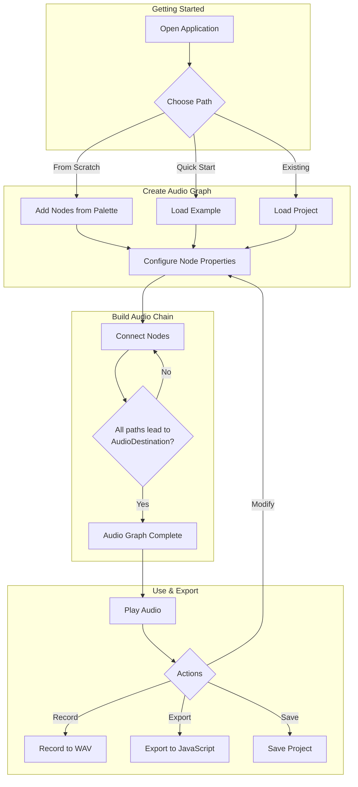
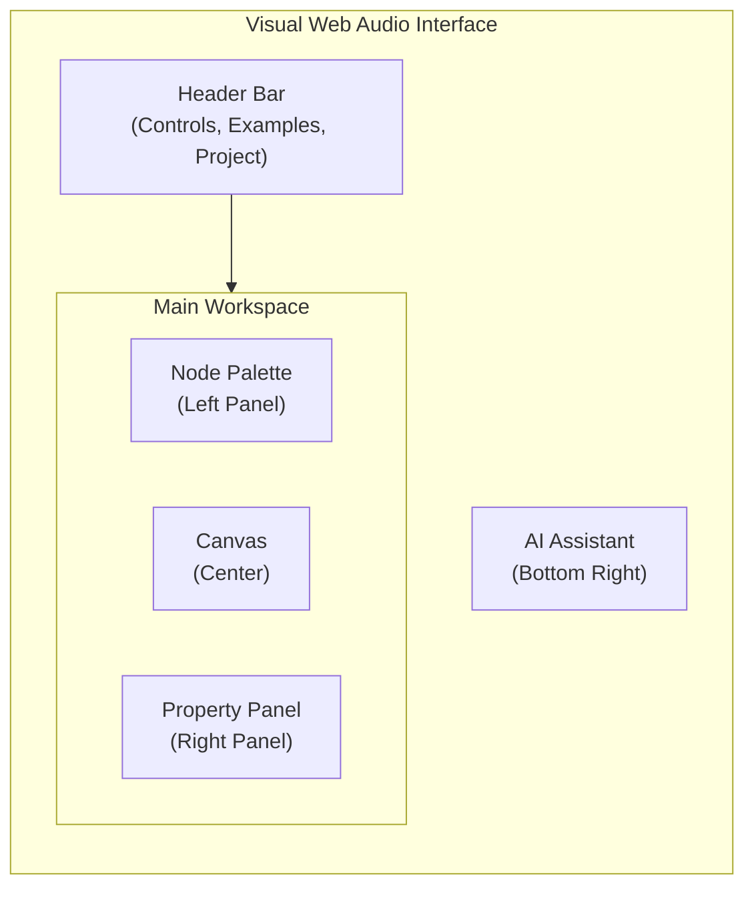
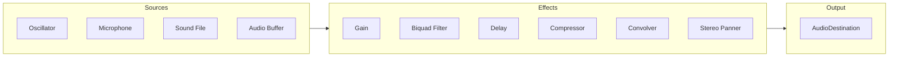
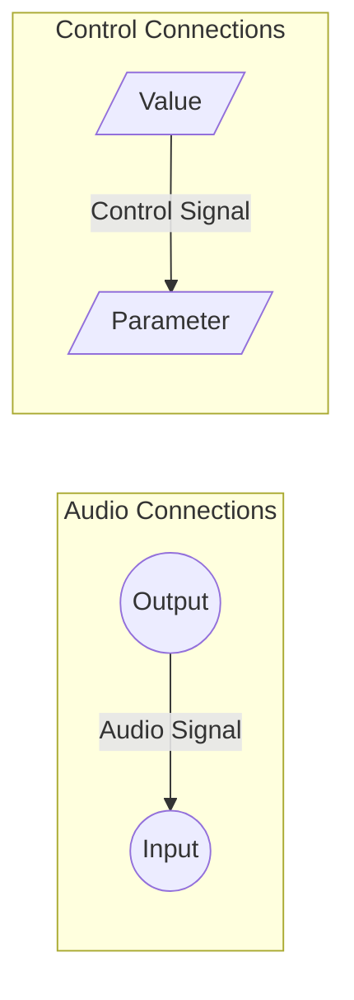
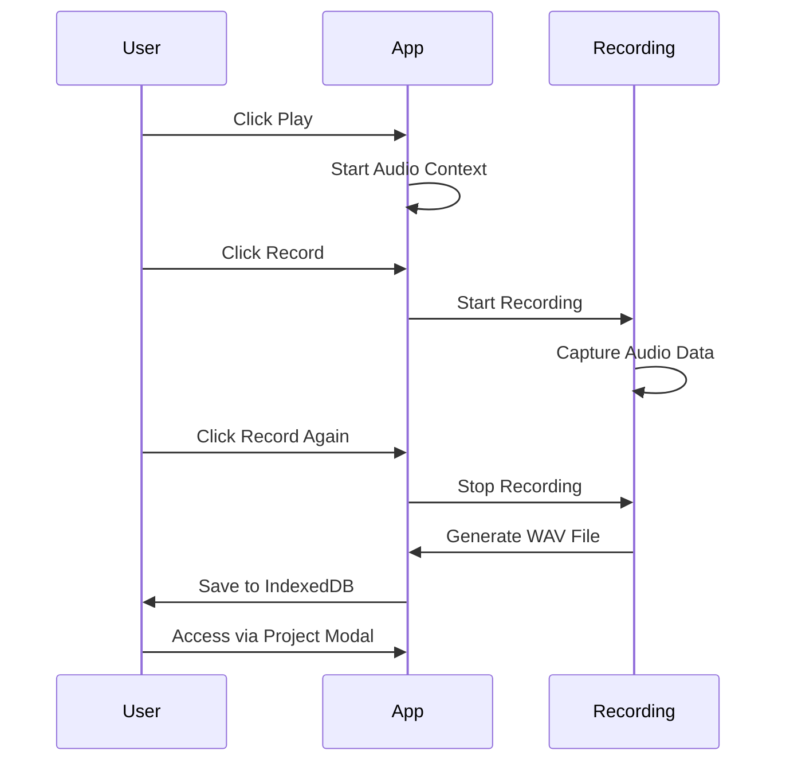
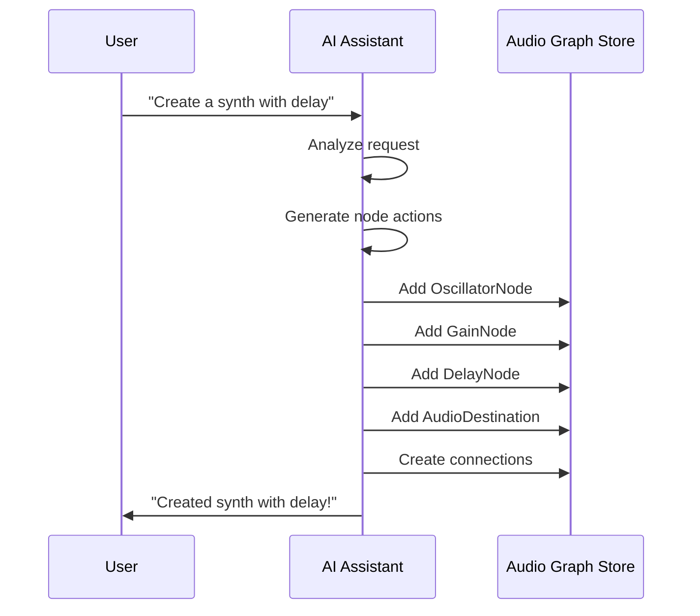
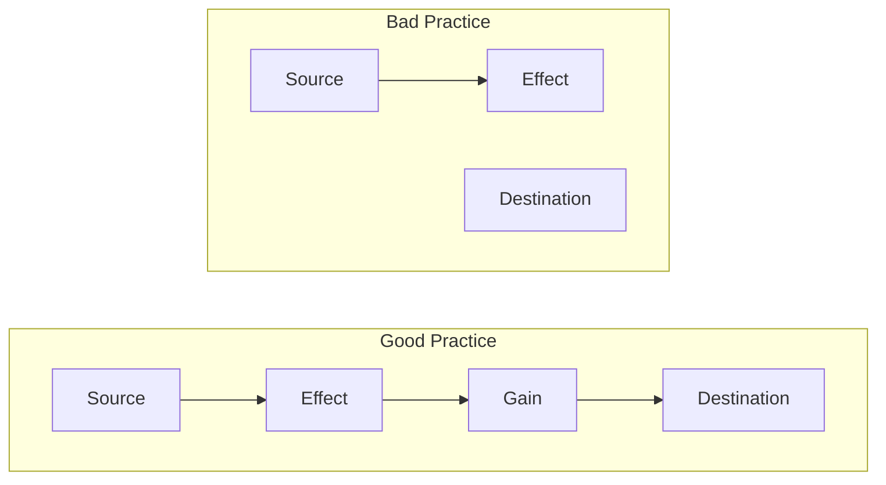

# Visual Web Audio - User Guide

Welcome to Visual Web Audio! This comprehensive guide will walk you through all the features and functionality of this powerful browser-based audio synthesis application.

## Table of Contents

1. [Getting Started](#getting-started)
2. [Interface Overview](#interface-overview)
3. [Working with Nodes](#working-with-nodes)
4. [Making Connections](#making-connections)
5. [Audio Controls](#audio-controls)
6. [Recording Audio](#recording-audio)
7. [Project Management](#project-management)
8. [Quick Examples](#quick-examples)
9. [Custom Nodes](#custom-nodes)
10. [AI Assistant](#ai-assistant)
11. [Export Functionality](#export-functionality)
12. [Keyboard Shortcuts](#keyboard-shortcuts)
13. [Tips and Best Practices](#tips-and-best-practices)
14. [Troubleshooting](#troubleshooting)

---

## Application Workflow

The following diagram illustrates the typical workflow when using Visual Web Audio:



---

## Getting Started

Visual Web Audio is a web-based application that runs entirely in your browser. No installation is required!

### System Requirements
- Modern web browser (Chrome, Firefox, Safari, Edge)
- Audio output device (speakers or headphones)
- For MIDI features: MIDI-compatible device (optional)

### First Launch
1. Open the application in your web browser
2. Allow audio permissions when prompted
3. You'll see the main interface with an empty canvas
4. Start by adding your first audio node from the Node Palette

> **⚠️ IMPORTANT: To hear any sound, you MUST connect your audio chain to an AudioDestination node!** Without this final connection, no audio will be output to your speakers/headphones.

### Progressive Web App (PWA)

Visual Web Audio is installable as a PWA for a native app-like experience:
- **Offline Functionality**: Core app works offline
- **Installable**: Add to home screen on mobile/desktop
- **Automatic Updates**: Always get the latest version
- **Fast Loading**: Cached resources for instant startup

---

## Interface Overview

### Main Components



#### Header Bar
- **Play/Stop Button**: Controls audio playback (green = play, red = stop)
- **Record Button**: Start/stop audio recording (only available during playback)
- **Quick Examples**: Dropdown with 27+ pre-built audio setups
- **Project Button**: Access project management features
- **Export JS**: Generate JavaScript code from your audio graph
- **Clear All**: Remove all nodes and connections
- **Undo/Redo**: Navigate through your editing history
- **Dark Mode Toggle**: Switch between light and dark themes
- **Help (?)**: Access this user guide
- **GitHub Ribbon**: Link to the open-source repository

#### Node Palette (Left Panel)
Organized categories of audio nodes:
- **Sources**: Audio generators (Oscillator, Audio Buffer, etc.)
- **Effects**: Audio processors (Gain, Filter, Delay, etc.)
- **Analysis**: Audio analysis tools (Analyser, etc.)
- **Custom**: Special nodes (Button, Slider, Timer, Display, Logic, MIDI, etc.)
- **Destination**: Audio output (Destination Node)
- **Microphone Input**: Quick access to start microphone input

#### Canvas (Center)
The main workspace where you:
- Add and arrange audio nodes
- Create connections between nodes
- Visualize your audio graph
- Pan and zoom to navigate large graphs

> **⚠️ Remember**: All audio paths must end at an AudioDestination node to produce sound!

#### Property Panel (Right Panel)
- View and edit properties of selected nodes
- Real-time parameter adjustment
- Node metadata and documentation

#### AI Assistant (Bottom Right)
- Click the "AI" button to open the AI chat
- Get help building audio graphs with natural language
- Supports OpenAI, Anthropic, and Google AI models

### Mobile Interface
On mobile devices:
- Hamburger menus provide access to Node Palette and controls
- Touch-friendly interaction
- Responsive design adapts to screen size

---

## Working with Nodes

### Audio Signal Flow



### Adding Nodes
1. **From Node Palette**: Click any node type to add it to the canvas
2. **Drag & Drop**: Drag nodes from palette to specific canvas locations
3. **Quick Examples**: Use pre-built setups as starting points
4. **AI Assistant**: Describe what you want and let AI create the graph

### Node Types

#### Audio Sources
- **OscillatorNode**: Generates waveforms (sine, square, sawtooth, triangle)
- **AudioBufferSourceNode**: Plays audio files
- **MediaElementAudioSourceNode**: Uses HTML audio/video elements
- **MediaStreamAudioSourceNode**: Captures microphone input

#### Audio Effects
- **GainNode**: Controls volume/amplitude
- **BiquadFilterNode**: Frequency filtering (lowpass, highpass, bandpass, allpass, etc.)
- **DelayNode**: Echo and delay effects
- **ConvolverNode**: Reverb and impulse response processing
- **DynamicsCompressorNode**: Audio compression
- **WaveShaperNode**: Distortion and waveshaping
- **StereoPannerNode**: Left/right panning
- **ChannelSplitterNode**: Split stereo to mono channels
- **ChannelMergerNode**: Merge mono channels to stereo

#### Analysis Nodes
- **AnalyserNode**: Frequency and waveform analysis

### Custom Nodes

Visual Web Audio includes 10+ custom nodes for enhanced functionality:

| Node | Purpose | Inputs | Outputs |
|------|---------|--------|---------|
| **SliderNode** | Interactive value control | - | value |
| **ButtonNode** | Trigger events | - | trigger |
| **DisplayNode** | Show numeric values | input | output |
| **TimerNode** | Periodic triggers | - | trigger |
| **RandomNode** | Random value generation | - | value |
| **SoundFileNode** | Audio file playback | trigger | output |
| **MidiInputNode** | MIDI device input | - | note, velocity |
| **MidiToFreqNode** | MIDI note to frequency | midiNote | frequency |
| **ScaleToMidiNode** | Scale degree to MIDI | scaleDegree | midiNote |
| **GreaterThanNode** | Conditional logic | input | output |
| **EqualsNode** | Equality comparison | input | output |
| **SelectNode** | Value selection | inputs | output |

### Node Properties
Each node has different configurable properties depending on its type. These appear in the Property Panel when you select a node and can be adjusted in real-time.

### Selecting and Editing Nodes
1. **Click** a node to select it
2. **Properties Panel** shows editable parameters
3. **Real-time Changes**: Modifications apply immediately during playback
4. **Delete**: Select node and press Delete key
5. **Copy/Paste**: Use Ctrl+C/Ctrl+V to duplicate nodes (preserves connections!)

---

## Making Connections

> **⚠️ CRITICAL: For any audio to be heard, your audio chain MUST end with a connection to an AudioDestination node!** This is the final output that sends audio to your speakers/headphones.

### Connection Types



### Audio Connections
Connect audio outputs to audio inputs:
1. **Click and Drag** from an output port to an input port
2. **Visual Feedback**: Connection lines show audio flow
3. **Multiple Connections**: One output can connect to multiple inputs

### Control Connections
Connect control signals (from custom nodes):
1. **Trigger Connections**: Button -> Oscillator (start/stop)
2. **Parameter Control**: Slider -> Gain (volume control)
3. **Automation**: Timer -> Multiple parameters
4. **MIDI Control**: MidiInput -> MidiToFreq -> Oscillator.frequency

### Connection Rules
- Audio outputs (circles) connect to audio inputs (circles)
- Control outputs (squares) connect to control inputs (squares)
- One output can connect to multiple inputs
- Inputs can only receive one connection at a time

### Managing Connections
- **Delete Connection**: Click the connection line and press Delete
- **Reconnect**: Drag from output to new input
- **Visual Indicators**: Different colors for audio vs. control signals

---

## Audio Controls

### Playback Control
- **Play Button**: Start audio processing and playback
- **Stop Button**: Stop all audio processing
- **Global Control**: Affects entire audio graph simultaneously

### Volume and Monitoring
- **Master Volume**: Control overall output level
- **Node-level Gain**: Individual volume controls per audio path
- **Visual Feedback**: Analyser nodes show audio levels and spectrums

### Audio Context
- **Sample Rate**: Typically 44.1kHz (browser dependent)
- **Buffer Size**: Optimized for low latency
- **Audio Destination**: Routes to your system's audio output

---

## Recording Audio

### Recording Workflow



### Starting a Recording
1. **Start Playback**: Click the Play button
2. **Click Record**: Record button becomes available during playback
3. **Recording Indicator**: Button turns red when recording

### Recording Process
- **Format**: WAV (16-bit PCM stereo)
- **Quality**: Full audio quality, no compression
- **Real-time**: Records exactly what you hear
- **Duration**: No time limits (limited by available memory)

### Stopping Recording
- **Manual Stop**: Click the Record button again
- **Auto-stop**: Recording stops when playback stops
- **Pause Behavior**: Pausing playback automatically stops and saves recording

### Managing Recordings
Access via Project -> Recordings tab:
- **View All**: List of all saved recordings
- **Download**: Save recordings to your computer
- **Rename**: Edit recording names (preserves creation date)
- **Delete**: Remove unwanted recordings
- **Storage**: Recordings saved locally in IndexedDB

---

## Project Management

### Saving Projects
1. **Click Project Button** in header
2. **Projects Tab**: Enter project name
3. **Save**: Stores complete audio graph configuration
4. **Local Storage**: Projects saved in IndexedDB

### Loading Projects
1. **Project -> Projects Tab**
2. **Select Project**: Click on any saved project
3. **Load**: Replaces current graph with saved configuration
4. **Confirmation**: Warns if current work will be lost

### Project Features
- **Auto-save**: Projects include all nodes, connections, and properties
- **Naming**: Descriptive names help organize your work
- **Export**: Projects can be exported as JavaScript code
- **Import/Export JSON**: Full project serialization

### Storage Management
- **IndexedDB Storage**: All data stored locally in your browser
- **Privacy**: No data sent to external servers
- **Backup**: Export important projects as code or JSON
- **Cleanup**: Delete unused projects to free space

---

## Quick Examples

Visual Web Audio includes **27 pre-built examples** organized by category:

### Synthesizers
| Example | Description |
|---------|-------------|
| **Vintage Analog Synth** | Classic analog synthesizer with oscillators, resonant filter, delay |
| **MIDI to Frequency** | Control oscillator frequency via MIDI note slider |
| **MIDI Delay Effect** | Complex delay with MIDI-controlled oscillator and feedback |
| **MIDI Pentatonic** | Pentatonic scale synthesizer with multiple oscillators |
| **Chord Synthesis** | Multiple oscillators creating a C major chord |

### Basic Audio Processing
| Example | Description |
|---------|-------------|
| **Basic Oscillator** | Simple sine wave connected to output |
| **Filter Sweep** | Oscillator with animated lowpass filter |
| **Delay Effect** | Oscillator with delay and feedback |
| **Stereo Panning** | Automated stereo panning effect |
| **Compressor Effect** | Dynamic range compression |
| **Tremolo Effect** | Amplitude modulation |
| **Ring Modulation** | Two oscillators with ring modulation |
| **Waveshaper Distortion** | Distortion effect |
| **Phaser Effect** | Multiple filters creating phaser effect |
| **Simple Noise** | White noise generator with filter |
| **Amplitude Envelope** | LFO envelope modulation |
| **Beat Frequency** | Two detuned oscillators creating beats |
| **Convolution Reverb** | Reverb effect |
| **Stereo Effects** | Channel splitting and merging |

### Voice Effects
| Example | Description |
|---------|-------------|
| **Robot Voice (Ring Mod)** | Transform voice using ring modulation |
| **Vocoder Voice** | Multi-band vocoder effect |
| **Voice Harmonizer** | Layer voice with musical harmonies |
| **Voice Pitch Shifter** | Delay-based pitch modulation |
| **Microphone Input with Delay** | Live mic with delay and feedback |
| **Microphone Reverb** | Live mic with convolution reverb |

### Sound File Playback
| Example | Description |
|---------|-------------|
| **Sound File Player** | Button-triggered playback |
| **Auto File Player** | Timer-triggered automatic playback |

### Using Examples
1. **Examples Dropdown**: Click in header
2. **Select Example**: Choose from available options
3. **Auto-load**: Example replaces current graph
4. **Auto-play**: Audio starts immediately
5. **Modification**: Use as starting point for your own creations

---

## AI Assistant

Visual Web Audio includes an AI-powered assistant that can help you build audio graphs using natural language.

### Supported AI Providers
- **OpenAI**: GPT-4, GPT-4 Turbo, GPT-3.5 Turbo
- **Anthropic**: Claude 3.5 Sonnet, Claude 3 Opus, Claude 3 Haiku
- **Google**: Gemini Pro, Gemini Pro Vision

### Setting Up the AI Assistant
1. Click the **AI** button in the bottom-right corner
2. Click the **gear icon** to open settings
3. Select your AI provider
4. Enter your API key
5. Choose storage method:
   - **Session**: Key stored temporarily (cleared on browser close)
   - **Encrypted**: Key encrypted and stored persistently

### Using the AI Assistant
Simply describe what you want to create:
- "Create a vintage synthesizer with a filter"
- "Add a delay effect to my current setup"
- "Build a vocoder for voice processing"

The AI will:
1. Understand your request
2. Create the appropriate nodes
3. Connect them properly
4. Set initial parameter values

### AI Workflow



---

## Export Functionality

### JavaScript Export
1. **Export JS Button**: Click in header
2. **Generated Code**: Complete JavaScript implementation
3. **Standalone**: Code runs independently of the app
4. **Web Audio API**: Uses standard browser audio APIs

### Export Features
- **Complete Graph**: All nodes and connections included
- **Property Values**: Current parameter settings preserved
- **Runnable Code**: Ready to use in web applications
- **Documentation**: Comments explain code structure
- **Copy to Clipboard**: One-click copying

### Using Exported Code
Simply paste into an HTML file:
```html
<body>
  <script>
    // Paste the generated code here
  </script>
</body>
```

### Use Cases
- **Web Development**: Integrate into websites
- **Learning**: Study Web Audio API implementation
- **Backup**: Alternative project storage method
- **Sharing**: Send audio graphs to others

---

## Keyboard Shortcuts

### General
| Shortcut | Action |
|----------|--------|
| Ctrl/Cmd + Z | Undo last action |
| Ctrl/Cmd + Y | Redo last action |
| Ctrl/Cmd + C | Copy selected nodes |
| Ctrl/Cmd + X | Cut selected nodes |
| Ctrl/Cmd + V | Paste nodes |
| Delete | Remove selected node or connection |
| Escape | Deselect all items |

### Playback
| Shortcut | Action |
|----------|--------|
| Spacebar | Toggle play/stop (when canvas focused) |
| R | Toggle recording (during playback) |

### Navigation
| Shortcut | Action |
|----------|--------|
| Tab | Cycle through focusable elements |
| Arrow Keys | Fine-tune node positions (when selected) |
| Mouse Wheel | Zoom in/out on canvas |
| Click + Drag | Pan canvas |

---

## Tips and Best Practices

### Audio Graph Design



- **⚠️ ESSENTIAL RULE**: Always end with AudioDestination node for sound output
- **Start Simple**: Begin with basic oscillator -> gain -> destination
- **Add Gradually**: Build complexity step by step
- **Use Gain Nodes**: Control volume at multiple points
- **Monitor Levels**: Use analyser nodes to visualize audio

### Performance Optimization
- **Minimize Nodes**: Use only what you need
- **Efficient Routing**: Avoid unnecessary connections
- **Gain Control**: Prevent audio clipping and distortion
- **Browser Resources**: Complex graphs may impact performance

### Creative Techniques
- **Modulation**: Use LFOs to animate parameters
- **Layering**: Combine multiple oscillators
- **Effects Chains**: Series of connected processors
- **Feedback Loops**: Creative (but careful) signal routing

### Project Organization
- **Descriptive Names**: Clear project and recording names
- **Regular Saves**: Save work frequently
- **Export Backups**: Keep code exports of important projects
- **Documentation**: Use display nodes to label sections

---

## Troubleshooting

### Audio Issues

**No Sound Output**:
- **⚠️ FIRST CHECK**: Ensure your audio chain connects to an AudioDestination node
- Check browser audio permissions
- Verify system volume and audio device
- Check for muted gain nodes

**Distorted Audio**:
- Reduce gain levels throughout signal chain
- Check for clipping at analyser nodes
- Avoid excessive feedback
- Monitor overall output levels

**Latency Issues**:
- Close other audio applications
- Reduce browser tab count
- Simplify complex audio graphs
- Check system audio buffer settings

### Interface Issues

**Nodes Not Appearing**:
- Check browser zoom level
- Verify canvas area is visible
- Try refreshing the page
- Clear browser cache if needed

**Connection Problems**:
- Ensure compatible port types (audio to audio, control to control)
- Check for existing connections on input ports
- Verify nodes are properly loaded
- Try recreating problematic connections

**Property Panel Empty**:
- Click directly on a node to select it
- Ensure node is fully loaded
- Try selecting a different node first
- Refresh page if issue persists

### Browser Compatibility

**Web Audio Support**:
- Use modern browser versions
- Chrome and Firefox recommended
- Safari and Edge also supported
- Avoid Internet Explorer

**MIDI Issues**:
- Enable Web MIDI in browser settings
- Connect MIDI device before opening app
- Grant MIDI permissions when prompted
- Check device compatibility

### AI Assistant Issues

**API Key Not Working**:
- Verify the API key is correct
- Check that you have API credits/quota
- Try session storage instead of encrypted
- Ensure the selected model matches your provider

**AI Not Creating Graph**:
- Be specific in your requests
- Check that AudioDestination is mentioned
- Try simpler requests first
- Report issues on GitHub

### Performance Issues

**Slow Response**:
- Reduce number of active nodes
- Close other browser tabs
- Restart browser if needed
- Check system resources

**Memory Issues**:
- Clear browser cache
- Delete unused projects and recordings
- Avoid extremely long recordings
- Restart application periodically

### Getting Help
- **GitHub Issues**: Report bugs and request features
- **Documentation**: Refer to this guide and README
- **AI Assistant**: Ask for help within the app
- **Source Code**: Explore the open-source implementation

---

## Contributing

Visual Web Audio is open source! Contributions are welcome:
- **Bug Reports**: Help identify and fix issues
- **Feature Requests**: Suggest new functionality
- **Code Contributions**: Submit pull requests
- **Documentation**: Improve guides and examples

Visit the [GitHub repository](https://github.com/miltonlaufer/visualwebaudio) to get involved!
